# Dokumentáció
## Látványosságok

Készítette: Madák Ildikó

### 1. Követelményanalízis
#### 1.1 Célkitűzés
Az alkalmazás célja megjeleníteni a felhasználók által beküldött látványosságok adatait. Az adatok védelme érdekében lehetőség van regisztrációra, majd bejelentkezésre. Bejelentkezett felhasználó új helyszíneket adhat hozzá a már meglévőkhöz, lehetősége van értékelni a mások által beküldött helyszíneket, valamint az önmaga által beküldötteket módosítani, törölni.
Az adminisztrátornak lehetősége van bármely beküldött helyszínt módosítani, vagy akár törölni.

#### Funkcionális követelmények
* Vendégek által elérhető funkciók
  - Regisztráció
  - Bejelentkezés
  - A főoldalon megtekinteni a legjobb értékelésű nevezetességeket
  - Látványosságok között szűrni név, elhelyezkedés alapján
* Bejelentkezett felhasználók által elérhető funkciók
  - Új látványosság hozzáadása
  - Látványosságok értékelése
  - Saját látványosság adatainak módosítása
  - Saját látványosság törlése
* Admin felhasználó által elérhető funkciók
  - Bármely látványosság törlése
  - Bármely látványosság adatainak módosítása
  - Új látványosság hozzáadása

#### Nem funkcionális követelmények
- Könnyű áttekinthetőség: színek használata a keresés megkönnyítéséhez, ésszerű elrendezés, hibásan bevitt adatok esetén a hiba egyértelmű jelzése
- Megbízhatóság: jelszóval védett funkciók

#### 1.2 Szakterületi fogalomjegyzék
- **Nehézség:** túrák osztályozása fizikai szükséglet szerint.
Például egy hegyvidéki kilátó több ponttal rendelkezik mint egy kis túraútvonal a völgyben
- **Jelleg:** a nevezetesség csoportosítása célcsoport, tematika szerint 
Például megkülönböztet tanösvényeket, múzeumokat, szabadidős programokat

#### 1.3 Használatieset-modell, funkcionális követelmények
- **Vendég:** Csak a publikus oldalakat éri el: főoldal, bejelentkezés, regisztráció
- **Bejelentkezett felhasználó:** A publikus oldalak elérésén kívül egyéb funkciókhoz is hozzájut: új nevezetesség felvétele, meglévő nevezetesség törlése/módosítása/értékelése
- **Bejelentkezett adminisztrátor:** Bármelyik nevezetességet módosíthatja, törölheti vagy új látványosságokat vehet fel.

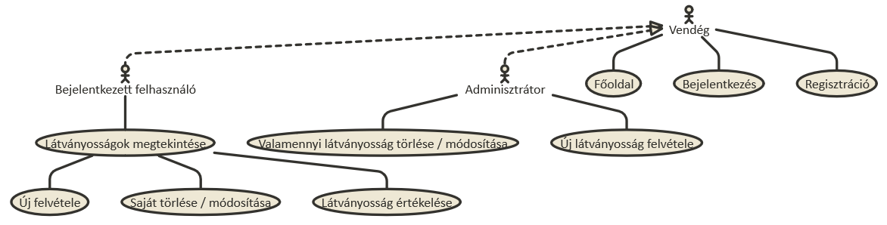

Egy folyamat szemléltetése:

**Meglévő látványosság szerkesztése:**

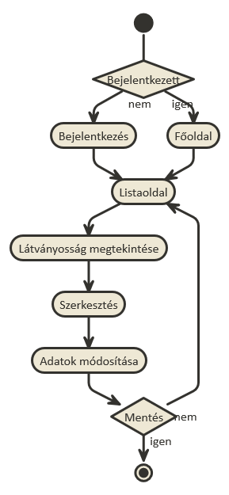

### 2. Tervezés
#### 2.1 Architektúra terv
##### 2.1.1 Komponensdiagram
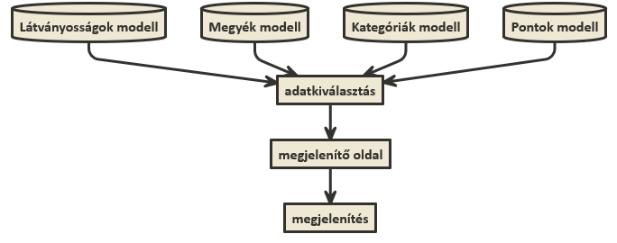
##### 2.1.2 Oldaltérkép
**Publikus:**
- Főoldal
- Látványosságok listázása
- Látványosságok között keresés
- Bejelentkezés
- Regisztráció

**Bejelentkezett:**
- Főoldal
- Új látványosság felvétele
- Saját nevezetesség kezelése
- Más által megadott nevezetesség értékelése

#### 2.1.3 Végpontok
- GET/: főoldal
- GET/login: bejelentkező oldal
- POST/login: bejelentkező adatok felküldése
- GET/home: bejelentkezettek főoldala
- GET/logout: kijelentkező oldal
- GET/regist: regisztrációs oldal
- POST/regist: regisztrációs adatok felküldése
- GET/sights: látványosságok listázása
- GET/sights/search: szűrés a látványosságok között
- GET/sights/create: új látványosság létrehozása
- POST/sights/create: új látványosság adatainak felküldése
- GET/sights/:id : látványosság megtekintése
- POST/sights/:id : látványosság értékelésének adatainak felküldése
- GET/sights/:id/delete: látványosság törlése
- GET/sights/:id/edit: látványosság adatainak szerkesztése
- POST/sights/:id/edit: látványosság új adatainak felküldése
- GET/sights/:id/editImage: látványossághoz tartozó kép módosítása
- POST/sights/:id/editImage: módosított adatok felküldése

#### 2.2 Felhasználói-felület modell
##### 2.2.1 Oldalvázlatok:

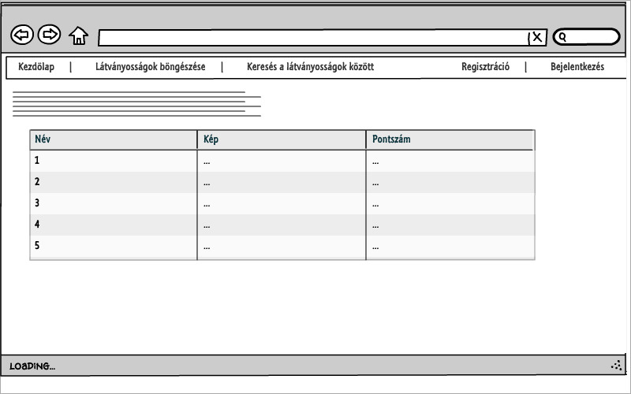

Kezdőlap

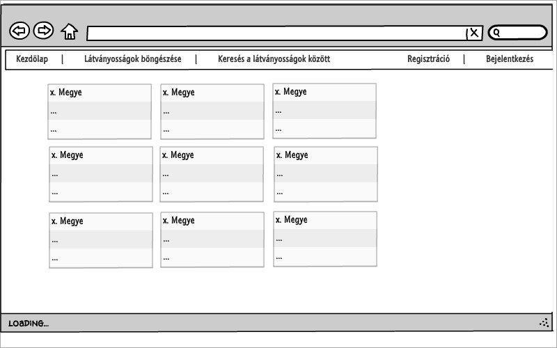

Látványosságok listázása

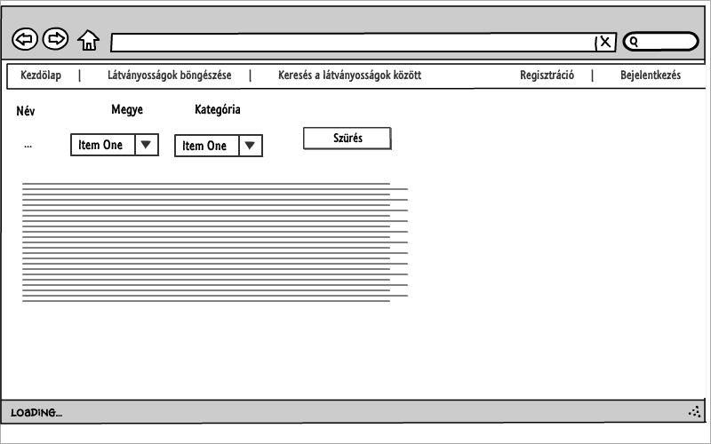

Keresés a látványosságok között

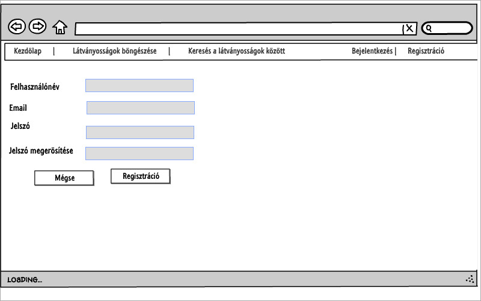

Regisztráció

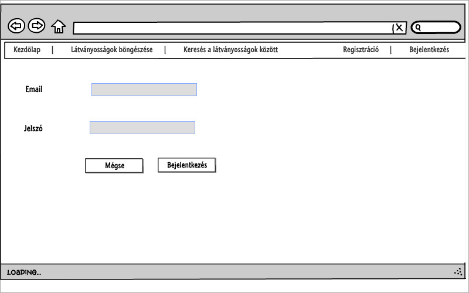

Bejelentkezés

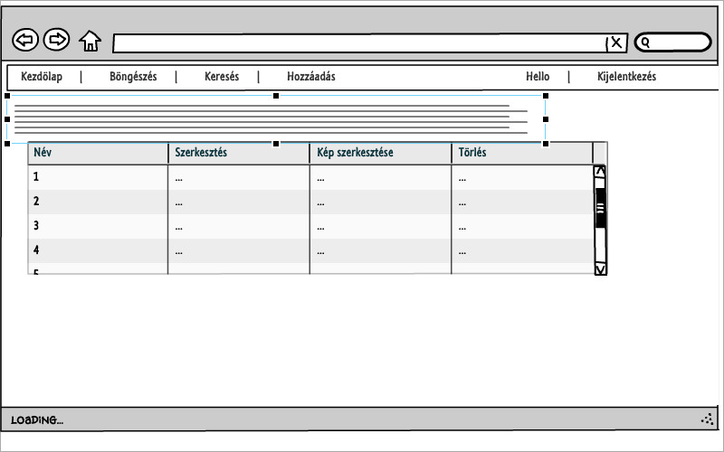

Bejelentkezett felhasználóhoz tartozó látványosságok

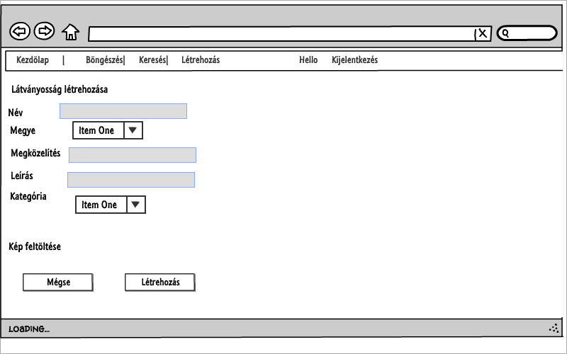

Látványosság hozzáadása

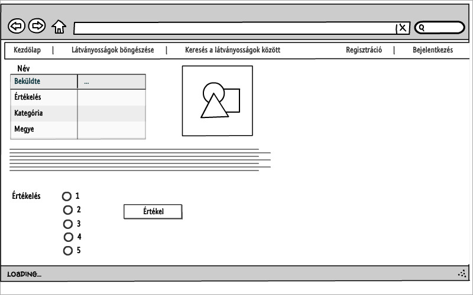

Látványosság adatainak megtekintése, értékelése (bejelentkezett felhasználóként)

##### 2.2.2 Designtervek (végső megvalósítás kinézete):
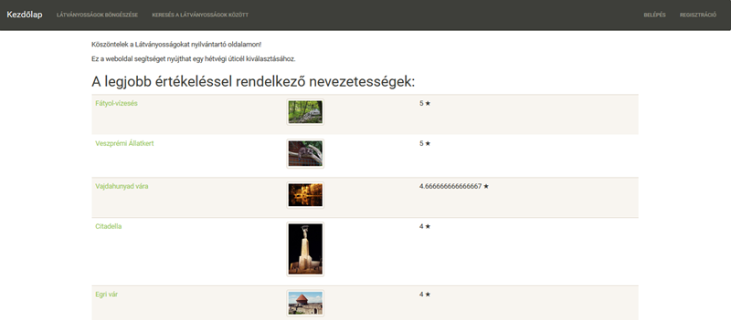

Kezdőlap

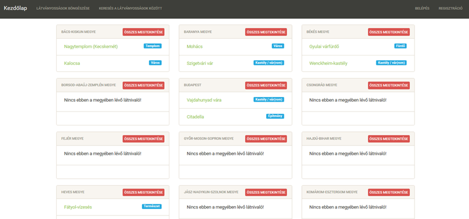

Látványosságok listázása

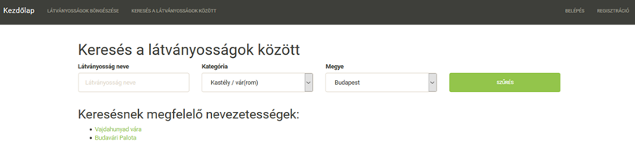

Keresés a látványosságok között

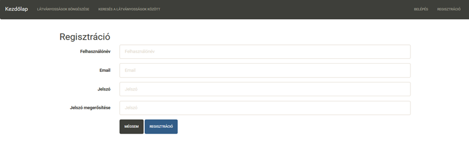

Regisztráció

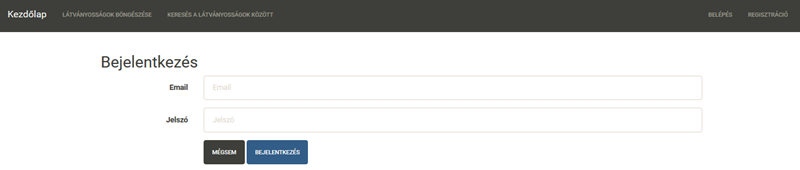

Bejelentkezés

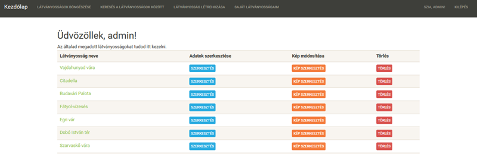

Bejelentkezett felhasználóhoz tartozó látványosságok

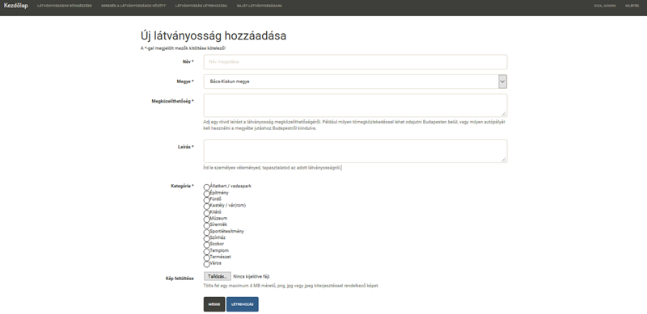

Látványosság hozzáadása

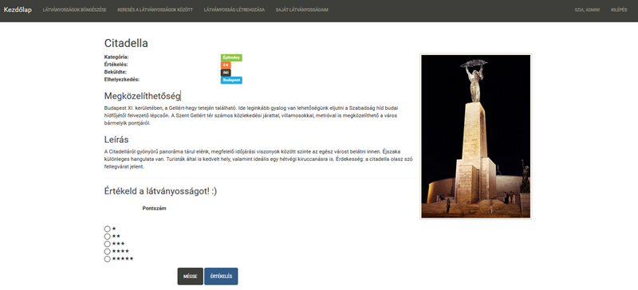

Látványosság adatainak megtekintése, értékelése (bejelentkezett felhasználóként)

##### 2.2.3 Osztálymodell:
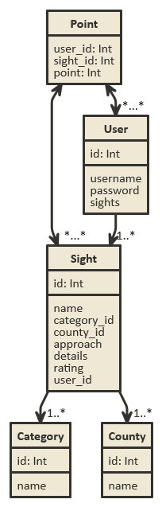
##### 2.2.4 Dinamikus működés:
**Szekvenciadiagramm**

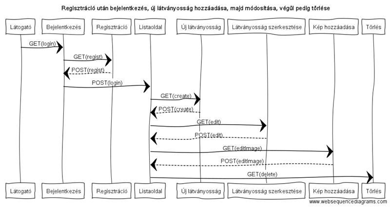

### 3. Implementáció
##### 3.1.1 Fejlesztőkörnyezet
- GitHub account szükséges
- Belépés után új repository létrehozása
- Ezután elkezdhetjük a kód írását
- git add paranccsal kiválaszthatunk egy fájlt verzionálásra
- git commit -m "commit" paranccsal feltehetjük a fájlokat a github oldalunkra
- A Github oldalán ellenőrizhetjük a munkánkat.

##### 3.1.2 Könyvtárstruktúra, funkciók:
- latnivalok
    - app
      - Http
        - Controllers
          - SightController
          - UserController
        - routes.js
      - Model
        - Category
        - County
        - Point
        - Sight
        - Token
        - User
    - database
      - migrations
      development.sqlite
    - images //dokumentációban szereplő képek//
    - public
      - images //Látványosságokhoz tartozó képek//
    - resources
      - views
        - countyShow
        - editImageSight
        - editSight
        - error
        - home
        - layout
        - list
        - login
        - main
        - newSight
        - regist
        - sightSearch
        - sightShow
      
### 4. Tesztelés
blablabla
........